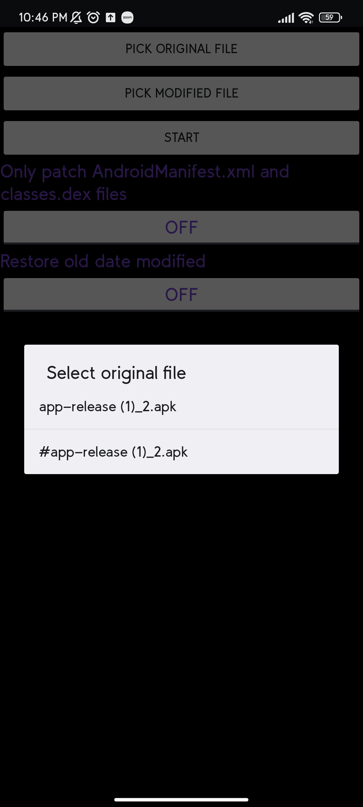

# RestoreCRC32
 Android app to set the CRC32 and date modified of files in an APK or ZIP archive to those from another archive.
 
 Some apps on Android (example: apps with Google Pairip Integrity protection) verify the validity of the app by checking the CRC32 and last modified date of files in its own APK. Restoring the values from the original file to a modified one can help in reverse analysis of the application. 
 
 Note: This is not the only step required in bypassing Pairip and it doesn't work on the latest version of Pairip
# Usage
There are 2 ways to use:
 * Open the app, use the buttons to select the original file and file to patch
 * Select multiple files and Share them, then select Restore CRC32 in the available options. Then you will see a dialog to pick the original file. After choosing, another dialog wiill allow you to choose which file to patch.
   * You can also patch multiple files at once in this way (May be useful if someone forgot to patch the CRC32 before splitting architectures or something).
 
 There are options to only patch the CRC32 of AndroidManifest.xml and classes.dex files, and to toggle the restoration of the last modified date of files in the archive.

## Problem
~~`The original file you pick must be the *actual* original, unmodified file and not one that you already restored the CRC of. Also, the file you want to patch must have all the CRCs valid. This means if you already restored the CRC32, you have to go and modify all the files that were changed before being able to restore it again. This is a big issue for modifying APKs since you might have to modify different files multliple times. For this reason, this app is mainly demonstrative as there are already several apps that can restore the CRC32 without this limitation like Apktool M, APKAnalyzer+.`~~ 

~~`This problem is caused because Java does not let you create a ZipEntry for a file with an invalid CRC32. In other words, if any CRC32 in the archive is invalid, Java will not let you extract or do anything with it, you can't access the file to change the CRC32. I think Apktool M, Lucky Patcher, and the other apps that allow restoring CRC32 use an external package to load the archive and modify it. I have no idea why spoofing the CRC32 actually works on Pairip because Java always throws a ZipException if the CRC32 is invalid.`~~ 

I fixed the main problem by using zip4j and removing verification of CRCs but the app is still slow and crashes on very large files because of having to read the entire file as a byte array, to avoid this we need MANAGE_EXTERNAL_STORAGE (All files access) to get a ZipFile instead of ZipInputStream.

# Screenshots
Screen after sharing files with the app

Main screen

Icon edited from <a href="https://vectorified.com/reset-button-icon">Reset Button Icon</a>
